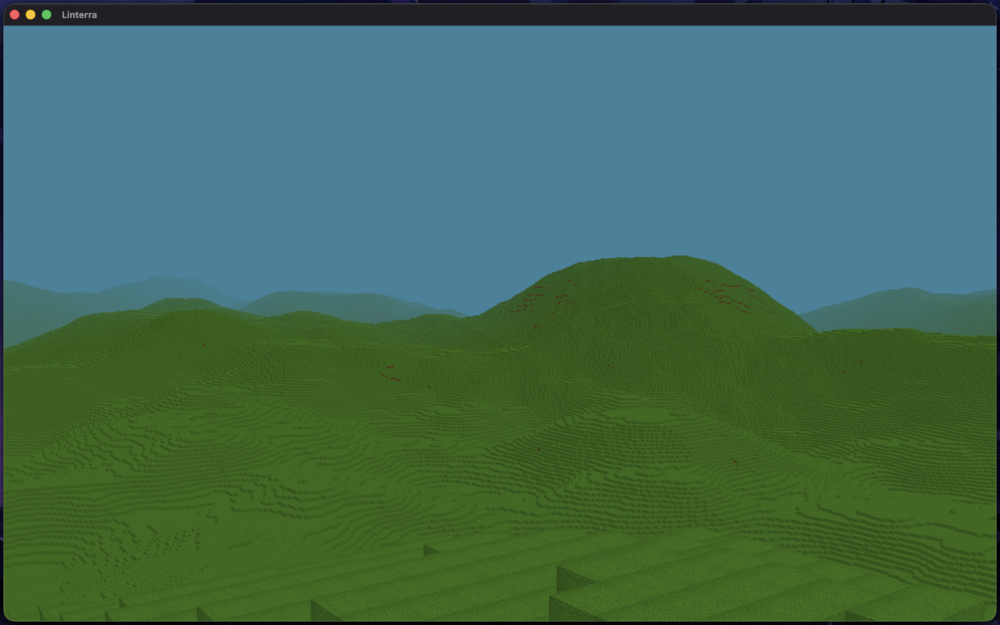

# Linterra: A Voxel Engine in C++ & OpenGL

## What is Linterra?

Linterra is a from-scratch, Minecraft-style voxel engine written in modern C++ and OpenGL. This project is an ongoing exploration into building a voxel engine from scratch. It is not a playable game yet; the focus so far has been designing the underlying systems that make an infinite, block-based world possible.



## Implemented Features

### Milestone 9 — GPU-Accelerated Terrain Generation & Platform-Adaptive Noise Fallback

This milestone introduced GPU compute shader acceleration for procedural terrain heightmap generation via Shader Storage Buffer Objects (SSBOs), along with platform-adaptive noise selection.

**GPU Compute Terrain Generation**
- Added `terrain.comp`: parallelizes FBM noise evaluation on the GPU using compute shaders (`local_size_x = 16`, `local_size_y = 16`).
- Integrated Shader Storage Buffer Objects (`BufferType::Storage`) to store generated heightmaps and read them back via `IRenderer::getBufferSubData`.
- Split chunk generation into independent heightmap generation (CPU vs GPU) and CPU-parallelized vertex meshing (`Chunk::generateMesh`).

**Platform-Adaptive Noise Flag**
- Added `Constants::Noise::USE_GPU` flag to control whether noise generation runs on the CPU or GPU.
- Implemented automatic fallback for macOS (`#if defined(__APPLE__)`), setting `USE_GPU = false` to avoid compilation errors on OpenGL 4.1 contexts while defaulting to GPU acceleration on OpenGL 4.3+ platforms.

### Milestone 8 — Split Fog into a Post-Process Pass

This milestone decoupled fog from the scene's fragment shader by moving it into a dedicated post-process stage, so general rendering and atmospheric effects are now independent subsystems.

**Offscreen Render Target**

- Added `Framebuffer` (`src/framebuffer.h` / `src/framebuffer.cpp`): owns an FBO with an RGBA color texture and a depth renderbuffer, resized on window changes. The scene's view-space distance is carried in the color alpha channel so the fog pass can reconstruct it without a depth-texture attachment.

**Two-Stage Render Pipeline**

- Scene pass (`render.vert` / `render.frag`): samples the texture atlas, applies directional face lighting, and writes shaded color + view distance — no fog math.
- Fog pass (`fog.vert` / `fog.frag`): a single attribute-less fullscreen triangle composites exponential fog over the offscreen scene using `uFogStart` / `uFogEnd` / `uFogColor`.
- `Application::update()` now renders the world into the framebuffer, then binds it as a sampler for the fog shader onto the default framebuffer. Window resize forwards to `Framebuffer::resize`.

**Shader Reorganization**

- Replaced the combined `shaders.vert` / `shaders.frag` with four focused files under `shaders/`: `render.vert`, `render.frag`, `fog.vert`, `fog.frag`. Paths live in `Constants` (`RENDER_VERTEX_PATH`, etc.).

### Milestone 7 — Unit Testing & CI

This milestone added a regression safety net so math-heavy subsystems can be validated automatically on every push, rather than verified by eye.

**Test Framework**

- Vendored [doctest](https://github.com/doctest/doctest) (single-header) at `vendor/doctest/include/doctest/doctest.h` — no external fetch step, matching the project's vendor-everything approach.
- New `linterra_tests` CMake target (gated by `BUILD_TESTS`, ON by default) compiles only the pure, no-GL-context subsystems: procedural `Noise`, `Camera` math, and `Frustum` culling.

**Test Coverage**

- `Noise`: fbm determinism, bounded `[-1,1]` output, continuity, seed round-trip/isolation.
- `Camera`: constructor placement, finite view/projection matrices, and a regression guard for the right-vector.
- `Frustum`: near-chunk inclusion, far-plane culling, side-plane culling, determinism.
- 13 test cases / 553 assertions, all passing.

**Decoupling & Bug Fixes Surfaced**

- `config.h` now guards GLAD/GLFW behind a `LINTERRA_NO_OPENGL` macro so pure math compiles without GL headers.
- Tests caught and fixed a real bug: `Camera::getRight()` computed `cross(m_Up, m_WorldUp)` (zero vector → NaN via `normalize`), silently corrupting frustum side-plane culling. Now uses `cross(m_Front, m_Up)`.
- Fixed case-sensitive includes (`"frustum.h"` → `"Frustum.h"`) in `frustum.cpp`/`manager.cpp` that warned on macOS and would break the build on Linux/Windows.

**Continuous Integration**

- Added `.github/workflows/ci.yml`: on every push and PR, Ubuntu + clang installs deps, configures with `BUILD_TESTS=ON`, builds `linterra_tests`, and runs `ctest --output-on-failure`.
- `ctest` exits non-zero on any failure, so a red test fails the job and blocks the merge on protected branches.

### Milestone 6 — Renderer Abstraction & Backend Portability

This milestone introduced a renderer abstraction layer to decouple the engine from OpenGL, enabling future support for Metal, Vulkan, and other graphics APIs through a unified interface. Also added cross-platform support for Linux and Windows.

**Cross-Platform Support**
- Made `GLFW_OPENGL_FORWARD_COMPAT` conditional for macOS only (`#if defined(__APPLE__)`).
- Added platform-specific build instructions for macOS (Homebrew), Linux (apt), and Windows (vcpkg).
- Project now builds and runs on macOS, Linux, and Windows.

**Renderer Interface Architecture**

- Created `IRenderer` interface with pure virtual methods for all core rendering operations (buffers, shaders, textures, draw calls, state management).
- Abstracted resource types: `IBuffer`, `IVertexArray`, `IShader`, `IShaderProgram`, `ITexture`.
- Defined enumerations for `BufferType`, `BufferUsage`, `ShaderType`, `TextureType`, `PrimitiveType`, `DataType`, `IndexType`, `Feature`, and `RenderBackend`.

**OpenGL Backend Implementation**

- Implemented full OpenGL backend: `OpenGLRenderer`, `OpenGLBuffer`, `OpenGLVertexArray`, `OpenGLShader`, `OpenGLShaderProgram`, `OpenGLTexture`.
- All OpenGL-specific code is now contained within `src/renderer/opengl/`.
- Existing `Shader`, `Texture`, and `Chunk` classes refactored to accept `IRenderer*` and delegate to the interface.

**Factory Pattern**

- Added `createRenderer(RenderBackend)` factory function for runtime backend selection.
- CMake build options added: `USE_OPENGL`, `USE_METAL`, `USE_VULKAN` (Metal/Vulkan not yet implemented).

**Codebase Refactoring**

- `Application` now owns the `IRenderer` instance and passes it to all rendering components.
- `ChunkManager` propagates the renderer to `Chunk` instances and `TaskResult` objects.
- Fixed RAII patterns for move-only resources across the codebase.

**Future Extensibility**

- To add Metal support: create `src/renderer/metal/` with implementations of the interface classes.
- To add Vulkan support: create `src/renderer/vulkan/` with implementations of the interface classes.
- Switching backends requires only changing the CMake option—no code changes needed in `Shader`, `Texture`, `Chunk`, `ChunkManager`, or `Application`.

### Milestone 5 — Chunk Pipeline Throughput, Thread Safety, and RAII Cleanup

This milestone focused on reducing chunk-generation stalls, removing key thread-safety hazards, and tightening resource lifetime management across the render pipeline.

**Chunk Generation Performance**

- Added an extended chunk-border heightmap cache so border exposure checks use direct array lookups instead of repeatedly calling noise functions.
- Consolidated duplicated chunk distance math into a shared helper in `ChunkManager` for both culling and spawn decisions.
- Moved chunk GPU upload commit to a main-thread-ready gate so worker threads only prepare mesh CPU data before signaling upload readiness.

**Threading & Race Condition Fixes**

- Added mutex-protected access around processing containers used by worker/main thread handoff.
- Ensured promotion/removal of in-flight chunk tasks is synchronized to avoid data races under load.

**Code Quality & Maintainability**

- Corrected configuration constant typos (`JUMP_VELOCITY`, `DEFAULT_PITCH`) and aligned usages.
- Standardized integer typing across touched systems toward `<cstdint>`-based types.
- Split `Player` implementation out of the header into `player.cpp` to reduce header bloat and avoid ODR-risk patterns.
- Removed dead commented callback code and deleted the unused `image.cpp` stub.

**OpenGL Resource Lifetime Improvements**

- Added RAII cleanup for shader programs (`glDeleteProgram`) via `Shader` destructor and safe move semantics.
- Improved chunk/texture resource move and cleanup behavior to prevent leaks or double-delete scenarios when objects are transferred.

### Milestone 4 — Architecture Overhaul & Memory Optimization

This milestone focused on restructuring the engine to support massive render distances (up to 64 chunks) while heavily optimizing memory consumption and setting up the foundation for asynchronous processing.

**Vertex Compression & Meshing Updates**

- Drastically compressed the vertex format from 28 bytes down to just 4 bytes per vertex.
- Removed greedy meshing to accommodate the new vertex layout and texture system. Combined with compression, this successfully halved memory usage at a 64-chunk render distance (dropping from 3.2 GB to 1.5 GB).

**Texture System Upgrade**

- Switched from an array of individual samplers to a unified `GL_TEXTURE_2D_ARRAY`.
- Improved GPU rendering performance (framerate nearly doubled at high chunk counts) and streamlined how block textures are accessed.

**Multithreading Foundation**

- Implemented a persistent work thread pool to begin offloading heavy operations (like chunk generation) from the main render thread.

**Terrain Data Enhancements**

- Transitioned from 3D heightmaps to 2D heightmaps to streamline terrain generation data and surface calculations.

### Milestone 3 — Textures & Performance

This milestone added textures, basic gravity and collision, and drastically improved performance.

**Perf Improvement**

- Added Element Buffers for each face
- Added greedy meshing to reduce triangle count
- Overall, with 24 chunks, speed: 54 fps -> **120 fps** and memory: 1.6 GB -> **0.3MB** _(Note: Greedy meshing was later superseded in M4 by vertex compression)_

**Textures**

- Added two basic textures for the landscape

**Gravity && Collisions**

- Added gravity option where user will fall down to the Earth
- Added ground collisions such that the user can stand on the landscape

### Milestone 2 — World Rendering & Performance

This milestone added actual voxel content, terrain generation, rendering efficiency, and early performance passes.

**Voxel Meshing System**

- Per-chunk face culling: only visible faces are emitted
- Generates a vertex buffer for each chunk at creation time
- Significantly reduces geometry vs. naïve full-cube rendering

**GPU Geometry Upload**

- Each chunk owns a VAO and VBO for its mesh
- Static draw buffers; draw calls are per chunk
- Deterministic creation and teardown of GPU resources

**View-Frustum Culling**

- Each chunk performs frustum intersection tests against camera planes
- Out-of-view chunks are skipped entirely in the render loop
- Big performance gains as world scale increases

**Noise-Based Procedural Terrain**

- Heightmap generation using layered Perlin noise
- Produces hills, slopes, and believable terrain variation across infinite chunks

**Block Storage System**

- Chunks contain a fixed 3D block array with typed block IDs
- Enables meaningful terrain data, not placeholder geometry

**Camera Math Improvements**

- Corrected right/front/up vector derivation
- More stable and consistent movement/orientation behavior

**Shader & Error Handling Improvements**

- Better visibility for shader compilation errors
- Validation for shader program linking
- Basic logging hooks added in critical paths

### Milestone 1 — Engine Foundations

The initial milestone focused on building the foundation required for an infinite voxel world.

**Dynamic Chunk Management**

- A `ChunkManager` loads and unloads chunks based on camera position
- Chunks stored in an `std::unordered_map` keyed by a custom `glm::vec2` hash
- Fixed render distance; out-of-range chunks are pruned each frame
- Supports a theoretically infinite world while keeping memory bounded

**First-Person Camera**

- Standard fly-through camera with yaw/pitch mouse-look
- WASD + Space/Shift movement
- Adjustable speed, sensitivity, and FOV

**Modern Shader Abstraction**

- A `Shader` class handles reading, compiling, linking shader programs
- Uniform location caching to reduce driver calls

**Basic Rendering Pipeline**

- Window and input via GLFW
- OpenGL loading via GLAD
- Core render loop with event dispatching and input callbacks

---

## Technical Stack

- **Language:** C++23
- **Graphics:** OpenGL 3.3+ on Apple / non-GPU-noise platforms; OpenGL 4.3+ elsewhere (GPU compute terrain path). Rendering goes through an `IRenderer` abstraction layer (`src/renderer/`) with an OpenGL backend in `src/renderer/opengl/`.
- **Libraries:**
  - **GLFW** — windowing & input
  - **GLAD** — OpenGL function loading (vendored)
  - **GLM** — mathematical foundations (matrices, vectors)
  - **Dear ImGui** — debug UI (vendored)
  - **stb_image** — texture loading (vendored)
  - **FastNoise-style noise** — procedural terrain (vendored)
  - **doctest** — unit testing (vendored)

> Note: SDL3 appears in some historical build configs but the current codebase is GLFW-only — the windowing backend lives entirely in the OpenGL renderer (`glfwInit`, `ImGui_ImplGlfw_InitForOpenGL`).

---

## Building & Running

### Prerequisites

- macOS 12+ / Linux / Windows 10+
- C++23-capable compiler (Clang, GCC, or MSVC)
- CMake 3.16+
- [just](https://github.com/casey/just) (optional — convenience recipes)

**macOS (Homebrew):**

```bash
brew install glfw glm
```

**Linux (Debian/Ubuntu):**

```bash
sudo apt install libglfw3-dev libglm-dev
```

**Windows:**

- Install via vcpkg: `vcpkg install glfw3 glm`

> ⚠️ Known issue: as of this writing, `main`'s `CMakeLists.txt` still compiles `imgui_impl_sdl3.cpp` and links SDL3 while `src/application.cpp` uses the ImGui GLFW backend. Until that mismatch is fixed upstream, building the game target requires either installing SDL3 or adjusting those two CMake entries. The `linterra_tests` target is unaffected and builds headlessly. See [CONTRIBUTING.md](CONTRIBUTING.md) for dev workflow details.

### Build

With CMake directly:

```bash
git clone https://github.com/amodhakal/linterra.git
cd linterra
cmake -S . -B build -DCMAKE_BUILD_TYPE=Release
cmake --build build --parallel
```

Or with `just` (see `justfile` for all recipes):

```bash
just build    # release build
just dev      # debug build with sanitizers
```

### Run

```bash
./build/linterra
```

### Unit Tests

The pure (no-GL-context) subsystems — procedural noise, camera math, and
frustum culling — have a doctest-based unit suite in `tests/`. The test
executable is built alongside the game and requires only GLM (no OpenGL/GLFW
runtime), so it can run in headless CI.

```bash
# configure + build everything (tests are ON by default)
cmake -S . -B build
cmake --build build

# build + run the suite directly, or via ctest
cmake --build build --target linterra_tests
./build/linterra_tests
ctest --test-dir build --output-on-failure
```

Or simply:

```bash
just test
```

To omit the test target (e.g. when only building the game):

```bash
cmake -S . -B build -DBUILD_TESTS=OFF
```

The doctest framework is vendored at `vendor/doctest/include/doctest/doctest.h`
— no extra dependency to fetch.
