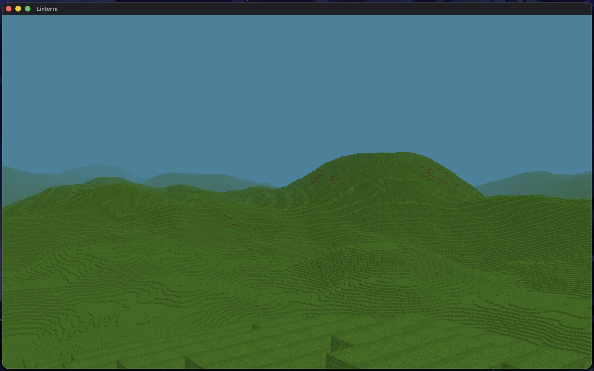

# Linterra: A Voxel Engine in C++ & OpenGL

## What is Linterra?

Linterra is a from-scratch, Minecraft-style voxel engine written in modern C++ and OpenGL. This project is an ongoing exploration into building a voxel engine from scratch. It is not a playable game yet; the focus so far has been designing the underlying systems that make an infinite, block-based world possible.



## Technical Stack

- **Language:** C++23
- **Graphics:** OpenGL 3.3+ on Apple / non-GPU-noise platforms; OpenGL 4.3+ elsewhere (GPU compute terrain path). Rendering goes through an `IRenderer` abstraction layer (`src/renderer/`) with an OpenGL backend in `src/renderer/opengl/`.
- **Libraries:**
  - **GLFW** — windowing & input
  - **GLAD** — OpenGL function loading (vendored)
  - **GLM** — mathematical foundations (matrices, vectors)
  - **Dear ImGui** — debug UI (vendored)
  - **stb_image** — texture loading (vendored)
  - **FastNoise-style noise** — procedural terrain (vendored)
  - **doctest** — unit testing (vendored)

> Note: SDL3 is not a dependency. The windowing backend lives entirely in the OpenGL renderer via GLFW (`glfwInit`, `ImGui_ImplGlfw_InitForOpenGL`); earlier revisions of `CMakeLists.txt` still referenced SDL3 and the ImGui SDL3 backend, which has since been removed.

---

## Building & Running

### Prerequisites

- macOS 12+ / Linux / Windows 10+
- C++23-capable compiler (GCC >= 13, Clang >= 17, or MSVC >= 19.33 — the engine uses `<print>`)
- CMake 3.20+ (3.16–3.19 cannot represent `CMAKE_CXX_STANDARD 23`)
- [just](https://github.com/casey/just) (optional — convenience recipes)

**macOS (Homebrew):**

```bash
brew install glfw glm
```

**Linux (Debian/Ubuntu):**

```bash
sudo apt install libgl1-mesa-dev libglfw3-dev libglm-dev
```

**Windows:**

The build needs MSVC >= 19.33 for C++23 `<print>`, and the dependencies come
from vcpkg. Installing the packages is not enough on its own — `find_package`
cannot see them until CMake is pointed at the vcpkg toolchain file.

In a *Developer PowerShell* (so MSVC's environment is loaded):

```powershell
# 1. Get vcpkg and put it on the machine-wide path
git clone https://github.com/microsoft/vcpkg C:\vcpkg
C:\vcpkg\scripts\bootstrap-vcpkg.bat
setx VCPKG_ROOT C:\vcpkg

# 2. Install the dependencies, pinned to one triplet.
#    vcpkg defaults to x86-windows, so the triplet is not optional here.
C:\vcpkg\vcpkg install glfw3 glm --triplet=x64-windows

# 3. Configure with the toolchain file so find_package(glfw3) resolves
cmake -S . -B build -A x64 ^
  -DCMAKE_TOOLCHAIN_FILE=C:\vcpkg\scripts\buildsystems\vcpkg.cmake
cmake --build build --config Release --parallel
.\build\Release\linterra.exe
```

Notes:

- The toolchain file lives at `%VCPKG_ROOT%\scripts\buildsystems\vcpkg.cmake`,
  which is the path vcpkg's own documentation uses. You can also set
  `CMAKE_TOOLCHAIN_FILE` in a `CMakePresets.json` instead of passing it per
  invocation.
- `--triplet=x64-windows` (or `package:x64-windows` per package) matters: vcpkg
  defaults to `x86-windows`, and a triplet mismatch is the usual cause of
  `find_package(glfw3)` succeeding but the build failing to link.
- Visual Studio's generator is multi-config, so the output lands in
  `build\Release\` rather than `build\`, and `--config Release` is required —
  `CMAKE_BUILD_TYPE` is ignored by multi-config generators.
- **Windows is not currently built by CI.** There is no Windows job in
  `.github/workflows/ci.yml`, so these instructions are unverified by an
  automated check. Treat them as best-effort and open an issue if they are
  wrong — adding the runner is tracked separately.

Both the game and the test target configure and build with these commands. CI builds both, so a break in the game binary is caught on every push. See [CONTRIBUTING.md](CONTRIBUTING.md) for dev workflow details.

### Build

With CMake directly:

```bash
git clone https://github.com/amodhakal/linterra.git
cd linterra
git submodule update --init --recursive   # only needed for the Metal backend
cmake -S . -B build -DCMAKE_BUILD_TYPE=Release
cmake --build build --parallel
```

The single submodule is `vendor/metal-cpp`, for the unimplemented Metal
backend. It is not built or referenced today, so a plain clone is enough
unless you are working on that backend.

Or with `just` (see `justfile` for all recipes):

```bash
just build    # release build
just dev      # debug build with sanitizers
```

### Run

```bash
./build/linterra              # random world seed
./build/linterra 12345        # fixed world seed, echoed at startup
```

The optional argument is the world seed, an integer in `[0, 4294967295]`. It
is echoed on startup, so it is the first thing to quote when reporting a
terrain bug — the same seed reproduces the same world.

### Unit Tests

There are two test executables, both built alongside the game and both run by
`ctest`.

**`linterra_tests`** is a doctest-based unit suite for the pure (no-GL-context)
subsystems — procedural noise, camera math, frustum culling, `ThreadPool`,
`PackedVertex` bit layout, `IO`, and `Player` mouse-look. It links
`linterra_core`, the same static library the game links, so a test can never
pass against a private copy of the code the game does not use. It needs only
GLM at runtime, so it runs headless.

**`linterra_smoke`** covers the GL path, which the unit suite cannot reach at
all: it creates a *hidden* GLFW window — a real offscreen context with nothing
on screen — and drives the actual engine classes through shader compilation,
uniform resolution, buffer and VAO creation, chunk mesh upload, draw
submission, the offscreen framebuffer, and teardown. It needs a windowing
system, so on a headless Linux machine run it under `xvfb-run`.

```bash
# configure + build everything (tests are ON by default)
cmake -S . -B build
cmake --build build

# build + run the unit suite directly, or via ctest
cmake --build build --target linterra_tests
./build/linterra_tests

# run both (add --output-on-failure for detail on a red run)
ctest --test-dir build

# headless Linux: the smoke test needs a display
xvfb-run -a ctest --test-dir build
```

Or simply:

```bash
just test
```

To omit the test targets (e.g. when only building the game):

```bash
cmake -S . -B build -DBUILD_TESTS=OFF -DBUILD_SMOKE_TEST=OFF
```

The doctest framework is vendored at `vendor/doctest/include/doctest/doctest.h`
— no extra dependency to fetch.

---

## Roadmap

Milestones 1–12 and M18 are shipped (see [Implemented Features](#implemented-features) below). M13–M17 and M19 are the planned sequence, and they are strictly ordered — each gates the next. M18 is independent of engine behaviour and was worked in parallel with M10.

| Milestone | Title | Issues | Scope |
| --- | --- | --- | --- |
| ~~M10~~ | Build, CI & Safety Net | — | Shipped: headless smoke tests, game in CI, ASan/UBSan, shader validation, macOS runner |
| ~~M11~~ | Render Correctness: GPU Terrain & Culling | — | Shipped: uniform registration, SSBO slot lifetime, detectable readback failure, frustum & winding |
| ~~M12~~ | Resource Lifetime, Shutdown & Error Reporting | — | Shipped: shutdown ordering, worker exception isolation, GL error attribution, reload state |
| M13 | Threading, Chunk Pipeline & Player Physics | 11 | Physics query, race windows |
| M14 | Renderer Abstraction & Backend Portability | 9 | Split `IRenderer`, Metal/Vulkan |
| M15 | Streaming & Draw-Path Performance | 10 | Draw-call sorting, greedy meshing |
| M16 | Rendering Quality: Lighting, Water & Terrain | 9 | AO, water, biome variety |
| M17 | Gameplay: Interaction, Persistence & UI | 7 | Block editing, collision, HUD |
| ~~M18~~ | Documentation, Licensing & Code Hygiene | — | Shipped: licence, contributor guide, README accuracy, dead code, lint config |
| M19 | Spatial Partitioning & LOD | 1 | Sparse voxel octree |

Full dependency graph and issue lists: [docs/roadmap.md](docs/roadmap.md).

---

## Implemented Features

### Milestone 12 — Resource Lifetime, Shutdown & Error Reporting

This milestone makes resource ownership well-defined and failures diagnosable. The theme that emerged is narrower and more specific than the roadmap predicted: **four separate issues were the same defect — code that treated a *refusal* as *success*.** Every GL object was deleted after the context that owned it had gone; an exception from a worker took the whole process down instead of one chunk; `resizeOffscreenTarget` refused a 0x0 allocation and the caller rendered into framebuffer 0 anyway; `getBufferSubData` failed and the caller consumed the untouched buffer as terrain.

**Shutdown ordering.** `~Application` ended with an explicit `terminateWindowing()`. A destructor *body* runs before any member is destroyed, so the GL context was torn down while every GL-owning member was still alive — `~ChunkManager` deleted a VBO/EBO/VAO for each of up to ~3200 chunks, `~TextureArray` deleted textures, `~Shader` deleted programs, all with no current context and GLAD's pointers aimed at an unloaded driver image. Windowing teardown now lives inside `~OpenGLRenderer`, right after it releases its own objects, because **a renderer that owns GL objects owns the context they live in**. Making that structural rather than conventional is the point: no caller can get the order wrong.

**ThreadPool.** Two fixes, and the first would have turned a crash into a hang without the second. An exception escaping a worker called `std::terminate`; the realistic cause is `std::bad_alloc` from the mesher's `push_back` growth, with no OOM handling anywhere in the engine and a stated 1.5 GB resident at high render distance. Catching it alone would have stranded the chunk forever, because promotion gates on `uploadReady` — so a `failed` flag now lets the promotion loop reap it. Separately, shutdown **discards** the backlog rather than draining it: pressing Escape used to hang the process at 100% CPU with no window, meshing up to 1024 chunks that nothing would ever upload or draw.

**Diagnostics.** There was no `glfwSetErrorCallback`, no `GL_DEBUG_OUTPUT`, and no debug callback anywhere outside `vendor/`. The only error handling was a once-per-frame drain at the end of `update()`, which made three things wrong at once: errors carried no call-site information; the drain ran ~30 lines after the call, after three passes producing byte-identical output; and the 16-error cap left overflow queued, so **the next frame's drain printed errors raised by the previous frame's calls**. `GLFW_VERSION_UNAVAILABLE` was being reported as "Failed to create window", pointing at the window title rather than the driver.

**Reload & move semantics.** `Shader::load`/`loadCompute` replaced the program object while leaving the location cache intact, so every setter passed an integer referring to a slot in a program that no longer existed. A moved-from `OpenGLShader` reported `isCompiled() == true` with `getId() == 0` — the one flag callers gate on was stale, the one GL acts on had been reset.

**Three defects found that the milestone did not plan for**, all preconditions of the planned fixes:
- **`glMemoryBarrier` is a null GLAD function pointer on macOS** — a latent crash, surfaced when #151 moved the barrier to the read site, which is where the plan wanted it. Removing the guard makes the smoke test segfault immediately (`EXIT=139`).
- **The storage buffer had no allocation at all.** `convertBufferUsage` returned `GL_*_DRAW` for every buffer type, which is `GL_INVALID_ENUM` for `GL_SHADER_STORAGE_BUFFER`.
- **`terminateWindowing` could be called twice** once the destructor took ownership of it.

**Two planned items were latent rather than live**, which changes what the milestone bought: the shader reload path has no caller (the constructor loads each shader once), and nothing inspects a stage after moving it. Both are real fixes for what a hot-reload or context-recreate feature *would* hit, but neither is currently reachable.

**The texture path.** `stbi_load` opens with a plain `fopen`, so textures resolved against the working directory with no fallback while shaders got the executable-directory fallback — the engine found its shaders and then failed on its textures from any other launch directory. Both now go through `IO::resolvePath`, and the three paths moved into `config.h` beside the shader paths so there is one list of on-disk assets.

Measured on a clean Debug build at this commit: the unit suite grew from **81 test cases / 10358 assertions to 89 / 10378**, and the smoke test from **42 to 76 checks**. Both baselines were measured on a clean checkout of the pre-M12 tree rather than copied forward.

### Milestone 11 — Render Correctness: GPU Terrain & Culling

This milestone fixed the defects that made the rendered world visibly wrong, and it is the first milestone whose work could be *measured* rather than argued about — M10's headless smoke test is what made the difference between "would produce wrong terrain if the bound were ever violated" and a number.

Two of the three issues in the final stack were found to be **total, not conditional**. That distinction is the headline: the GPU terrain path was not subtly degraded, it was non-functional, and nothing reported it.

**The GPU terrain path did not work at all.** Three independent defects sat on the same path, each of which alone would have broken it:

- **The `uSlot` compute uniform was never registered** (#125). `terrain.comp` declares nine uniforms; `ChunkManager` registered eight. `Shader::setUniformUInt` drops any write to a name that was never registered, so `uSlot` kept its GLSL default of `0`, and the shader computed `uint base = uSlot * uExtSide * uExtSide` — always `0`. **Every GPU chunk wrote into slot 0** of the batched heightmap SSBO, and slots 1–63 were never written by anyone. This produces no GL error, because no illegal call is made: the write is simply skipped.
- **SSBO slots were recycled before their readback** (#126). The handout was `m_NextGpuSlot++ % kGpuSlots`, which consults nothing about the previous occupant. Readback is deferred by at least one frame, and one frame dispatches up to 1024 chunks against 64 slots, so **every slot was overwritten 16 times before the first readback could run**. Measured by simulating `render()`'s real ordering: **100% of readbacks (60416 / 60416) returned another chunk's heights.** Deterministic floating and overlapping terrain with hard seams along chunk borders — not an intermittent glitch.
- **The storage buffer had no allocation** (found while testing #151). `convertBufferUsage` returned `GL_*_DRAW` for every buffer type; for `GL_SHADER_STORAGE_BUFFER` all three are `GL_INVALID_ENUM`, and `glBufferData` then allocates nothing. The heightmap SSBO is the only storage buffer in the codebase, so on every non-Apple build its allocation had been silently failing. Usage is now mapped per buffer type.

Together these mean that on any build where `Constants::Noise::USE_GPU` is true — every non-Apple build — the engine's headline feature produced the heightmap of whichever chunk was dispatched last. The code comment asserting *"By now the compute dispatch is at least a frame old, so the GPU has almost always finished"* was true of the GPU and irrelevant: the slot's contents had already been replaced by something else.

**Failure that could not be detected** (#151). `getBufferSubData` returned `void`, and `glGetBufferSubData` has no return value: on failure it writes nothing and leaves the caller's buffer untouched. `Chunk::finishHeightMapGPU` could therefore not distinguish a successful read from a failed one, so it truncated whatever the allocator handed back into `uint16_t`, installed it as authoritative terrain, and set `m_GpuHeightMapReady = true` — guaranteeing the bad heights were never re-derived. It now returns `bool`, bounds-checks before reaching the driver, drains the GL error locally, and **retries** rather than committing garbage. The `GL_BUFFER_UPDATE` barrier also moved from `dispatchCompute` to the read site, where the invariant actually lives; it was documented in `chunk.cpp` and implemented three files away.

**Frustum & geometry.** The side-plane computation used degrees where radians were intended (#127); `isBlockExposed` gained a bounds assertion and the plane-normal/AABB conventions were pinned (#4, #66); the camera aspect ratio now updates on window resize (#12); bottom (−Y) faces were wound backwards and silently back-face culled, with the winding table made testable (#140).

**Heightmap correctness.** Chunk heightmaps are value-initialised and `getHighestBlockY` is non-public and bounds-checked (#135); the negative-`float`-to-`uint16_t` conversion was undefined behaviour and is now total, with out-of-range input clamped (#136).

**What made it verifiable.** The GPU defects were unreachable by the existing suite: `linterra_core` excludes `chunk.cpp` and `manager.cpp` because `chunk.h` includes `<glad/glad.h>` unconditionally. So the fixes are built on extracted, GL-free units that the unit suite can reach directly:

- `GpuSlotPool` (`src/gpu_slot_pool.h`) — a free-list with no GL and no `ChunkManager` state, so the slot-lifetime policy is tested directly rather than inferred. Seven cases, including an end-to-end simulation of the real frame ordering asserting no chunk ever reads another's slot, and one pinning the pre-fix number (4161 of 4225 stale) so it cannot silently rot.
- `Constants::TERRAIN_COMPUTE_UNIFORMS` — the compute shader's uniform list is now a single source of truth, and `tests/test_shader_uniforms.cpp` parses `terrain.comp` and compares against it **in both directions**. A guard case asserts the parse found ≥9 uniforms so the comparison cannot pass vacuously.
- `Shader::newUniform` no longer records a failed lookup. It used to store the `-1` it had just diagnosed, which made `setUniform*` believe the name was known and hand `-1` to GL, where it is ignored — so a name *registered but misspelled* failed just as silently as one never registered. The same bug class, from the other direction.

The suite grew from 70 test cases / 10183 assertions to **81 / 10358**, and the smoke test from 41 to **42 checks** (all three figures measured on a clean Debug build at this commit, not carried forward from the Milestone 10 numbers). Two smoke checks report an explicit `skip` rather than passing silently — see the verification note below.

**Two findings that contradict the milestone's own premise.** Both are worth recording precisely because they change what the milestone's remaining budget buys:

- **The GPU path could not be verified on the development platform.** `Constants::Noise::USE_GPU` is a `constexpr false` on Apple, so every fix here is provable as a *scheduling or uniform-registration property* and not as resulting terrain. macOS also caps at GL 4.1 with `GL_MAX_SHADER_STORAGE_BUFFER_BINDINGS == 0`, so the new readback assertions skip locally; Linux CI runs them under `xvfb` against Mesa. That CI run is the real verification and had not happened when these were written.
- **One latent crash was found by adding a barrier, not by the milestone's own scope.** `glMemoryBarrier` is a GLAD function pointer and is **null on this machine's context** — calling it is a jump to address 0. Moving the barrier to the read site turned a latent crash into an immediate segfault, which is how it was found; both call sites are now guarded on the pointer.

### Milestone 18 — Documentation, Licensing & Code Hygiene

This milestone changes no engine behaviour, which is what makes it independent: it was worked in parallel with Milestone 10 rather than after it. The theme is that a repository's claims about itself should be checkable, and that a linter is a better guarantee of a convention than a habit.

**Licensing & Provenance**
- Added an **MIT `LICENSE`** at the repository root. The repo had no stated terms, so there was no answer for a user or a contributor about what they were using or contributing into. MIT matches what the vendored dependencies already are.
- Recorded **doctest provenance** in `vendor/doctest/PROVENANCE.md`: version, upstream release, path, copyright holder, licence, size, and SHA-256, plus how to verify the copy and how to upgrade it. Verifying this found that the upstream raw URL needs the `v` on the tag (`v2.4.11`, not `2.4.11`) — that is now recorded so the next person does not lose the same time. The vendored header is byte-for-byte identical to the upstream release.

**Documentation Accuracy**
- `CONTRIBUTING.md` went from 12 lines to a full contributor guide: per-platform prerequisites, building, submodules, both test executables with the headless-Linux caveat, how to add a test and the GL-free admission rule for `linterra_core`, shader validation, formatting and linting, what CI runs, and the licence.
- **Ten factually wrong claims in this README were corrected**, each re-verified against the source rather than taken on trust: a documented `src/framebuffer.h` that does not exist, a `Framebuffer::resize` call that is really `IRenderer::resizeOffscreenTarget`, a missing `libgl1-mesa-dev` that makes configure fail on a clean Ubuntu, the entirely undocumented world-seed argument, a missing `git submodule update` step, an include-fixing note that pointed at a filename with the wrong case, and a "regression safety net" framing that overstated the suite.
- The Windows build instructions were rewritten. `vcpkg install glfw3 glm` alone cannot work: without `-DCMAKE_TOOLCHAIN_FILE` the `find_package` calls fail, and vcpkg defaults to the `x86-windows` triplet. They also now state plainly that **Windows is not built by CI**, so they are unverified by an automated check.

**Code Hygiene**
- Removed three pieces of dead code: a commented-out `Camera::processScrollInput` describing a function that was never declared, an empty `Application::processScrollInput` wired to a GLFW callback that fired into a no-op on every scroll event, and `Constants::DO_TRIANGLE_LINE` — a `constexpr false` branched on inside `Chunk::pass()`, i.e. evaluated on every chunk upload to call `setPolygonMode` exactly never.
- Removed the unused `TaskResult::pass()` forwarder; the one call site already reached through to the member it wrapped.

**Tooling**
- Committed **`.clang-tidy`**, which was absent. It declares the naming convention so it is enforced on new code rather than living in contributors' heads.
- The naming rules were derived from the tree rather than from an external style, and the survey is worth recording: **75 of the 77** `m_`-prefixed members already used PascalCase, so the entire member-naming inconsistency was `m_firstFrame` and `m_lastFrame`. Functions, parameters, locals, classes, scoped enums, and constants were already consistent with no outliers. This is therefore a two-identifier rename, not the sweeping reformat the issue title implies — a repo-wide rename would have been a large, hard-to-review diff for no consistency gain.

### Milestone 10 — Build, CI & Safety Net

This milestone turned "it builds on my machine" into an automated safety net. Previously the doctest suite covered pure math with no GL context, so the entire GL path — shader loading, buffer and VAO creation, chunk upload, the offscreen framebuffer, resource teardown — shipped unverified, and a break in the game binary could not be caught by any check.

**Build Correctness**
- Enabled compiler warnings that were previously absent: `-Wall -Wextra -Wpedantic -Wshadow` (and `/W4` on MSVC) via a shared `linterra_warnings` INTERFACE target, so the game and the test target cannot drift apart. All three defects this surfaced are fixed: a `-Wreorder-ctor` in `Player`, a double→float narrowing, and an anonymous struct inside a union in `PackedVertex` (a GNU extension, now a named `Fields` member with the bit layout unchanged).
- Raised the CMake floor from 3.16 to 3.20, since `CMAKE_CXX_STANDARD 23` is only understood from 3.20, and added an explicit toolchain gate (GCC ≥ 13, Clang ≥ 17, MSVC ≥ 19.33) so a missing `<print>` fails at configure time with a message naming the cause.
- Removed the duplicated renderer source list. The recursive glob already covered `src/renderer/opengl/*.cpp`, and the `if(USE_OPENGL)` block re-declared the same paths — which also meant `-DUSE_OPENGL=OFF` never actually excluded anything. The option now warns instead of silently doing nothing.
- `compile_commands.json` is emitted by default, so clangd, clang-tidy, and IDE tooling work with no extra flags.
- Fixed the `justfile`: `just fmt` had been skipping every `.hpp` file — seven of them, including the whole renderer interface. The misleading `clippy` alias is replaced by a standalone `tidy` recipe plus a `tidy-build` fallback, and `fmt-check` was added.

**CI Coverage**
- The build now runs on **macOS as well as Ubuntu**. This is not redundant: the engine is developed and run on macOS, and it is the only platform that compiles the `__APPLE__` branches — the `USE_GPU` noise selection in `config.h`, the `_NSGetExecutablePath` path in `io.cpp`, and the forward-compat and 3.3-context hints in the OpenGL renderer.
- **`linterra_smoke`**, a new headless executable that creates a *hidden* GLFW window — a real offscreen GL context with nothing on screen — and drives the actual engine classes through the sequence `Application` uses. It covers shader compilation and linking, uniform resolution, buffer and VAO creation, chunk mesh generation and GPU upload, draw submission, the offscreen framebuffer, and context teardown, asserting on observable state rather than pixels. 34 checks as of Milestone 10; the suite has since grown — see Milestone 11.
- **Shader validation** with `glslangValidator`, in its own job. Shaders are compiled by the driver at runtime, so a syntax error previously surfaced only as a broken frame on a machine with a GL context.
- **ASan + UBSan** over the suite, via a new `-DLINTERRA_SANITIZE` option. `just dev` had been able to do this locally but nothing ran it automatically. The option replaces a `CMAKE_CXX_FLAGS` string that never reached the C sources (`vendor/glad/src/glad.c`) or the link line reliably.

**Test Coverage**
- **`linterra_core`**, a static library of the GL-free engine sources (`camera`, `frustum`, `io`, `player`, `threadpool`) linked by both the game and the tests. Previously `linterra_tests` named `src/camera.cpp` and `src/frustum.cpp` directly, compiling a second copy — the suite was testing code the game did not use, and nothing would have caught the two drifting apart.
- **Four more subsystems under test**: `ThreadPool` (task completion, genuine concurrency, and enforcement of the pending-task cap that stops one frame flooding the pool), `PackedVertex` (the 4-byte vertex format pinned bit for bit), `IO` (byte-exact reads, CRLF and lone-CR preservation, the executable-directory fallback), and `Player` (mouse-look, pitch clamping, view-vector normalisation). The suite grew from 14 test cases / 554 assertions to **40 / 675** as of Milestone 10; it has since grown further — see Milestone 11.

**Notes**
- The smoke test runs on the Linux runner under `xvfb-run` with Mesa's software rasteriser. A GitHub macOS runner has no window server session, so no CGL context can be created there at all; the macOS job still compiles every Apple-specific branch and runs the unit suite.
- `-Wconversion` is deliberately *not* enabled yet: it emits 250+ findings, nearly all mechanical narrowing in the GL upload paths. That cleanup is outstanding.

### Milestone 9 — GPU-Accelerated Terrain Generation & Platform-Adaptive Noise Fallback

This milestone introduced GPU compute shader acceleration for procedural terrain heightmap generation via Shader Storage Buffer Objects (SSBOs), along with platform-adaptive noise selection.

**GPU Compute Terrain Generation**
- Added `terrain.comp`: parallelizes FBM noise evaluation on the GPU using compute shaders (`local_size_x = 16`, `local_size_y = 16`).
- Integrated Shader Storage Buffer Objects (`BufferType::Storage`) to store generated heightmaps and read them back via `IRenderer::getBufferSubData`.
- Split chunk generation into independent heightmap generation (CPU vs GPU) and CPU-parallelized vertex meshing (`Chunk::generateMesh`).

**Platform-Adaptive Noise Flag**
- Added `Constants::Noise::USE_GPU` flag to control whether noise generation runs on the CPU or GPU.
- Implemented automatic fallback for macOS (`#if defined(__APPLE__)`), setting `USE_GPU = false` to avoid compilation errors on OpenGL 4.1 contexts while defaulting to GPU acceleration on OpenGL 4.3+ platforms.

### Milestone 8 — Split Fog into a Post-Process Pass

This milestone decoupled fog from the scene's fragment shader by moving it into a dedicated post-process stage, so general rendering and atmospheric effects are now independent subsystems.

**Offscreen Render Target**

- Added an offscreen FBO inside the OpenGL backend (`OpenGLRenderer::resizeOffscreenTarget`, `src/renderer/opengl/opengl_renderer.cpp`, torn down by `destroyOffscreenTarget`): owns a framebuffer with an RGBA color texture and a depth renderbuffer, resized on window changes. The scene's view-space distance is carried in the color alpha channel so the fog pass can reconstruct it without a depth-texture attachment.

**Two-Stage Render Pipeline**

- Scene pass (`render.vert` / `render.frag`): samples the texture atlas, applies directional face lighting, and writes shaded color + view distance — no fog math.
- Fog pass (`fog.vert` / `fog.frag`): a single attribute-less fullscreen triangle composites exponential fog over the offscreen scene using `uFogStart` / `uFogEnd` / `uFogColor`.
- `Application::update()` now renders the world into the framebuffer, then binds it as a sampler for the fog shader onto the default framebuffer. Window resize forwards to `IRenderer::resizeOffscreenTarget`.

**Shader Reorganization**

- Replaced the combined `shaders.vert` / `shaders.frag` with four focused files under `shaders/`: `render.vert`, `render.frag`, `fog.vert`, `fog.frag`. Paths live in `Constants` (`RENDER_VERTEX_PATH`, etc.).

### Milestone 7 — Unit Testing & CI

This milestone added a regression safety net so math-heavy subsystems can be validated automatically on every push, rather than verified by eye. It is a partial net, and the gaps are known — see the caveat below.

**Test Framework**

- Vendored [doctest](https://github.com/doctest/doctest) (single-header) at `vendor/doctest/include/doctest/doctest.h` — no external fetch step, matching the project's vendor-everything approach.
- New `linterra_tests` CMake target (gated by `BUILD_TESTS`, ON by default) compiles only the pure, no-GL-context subsystems: procedural `Noise`, `Camera` math, and `Frustum` culling.

**Test Coverage**

- `Noise`: fbm determinism, bounded `[-1,1]` output, continuity, seed round-trip/isolation.
- `Camera`: constructor placement, finite view/projection matrices, and a regression guard for the right-vector.
- `Frustum`: near-chunk inclusion, far-plane culling, side-plane culling, determinism.
- 14 test cases / 554 assertions, all passing (as of Milestone 7; the suite has since grown — see Milestone 10).

**Decoupling & Bug Fixes Surfaced**

- `config.h` now guards GLAD/GLFW behind a `LINTERRA_NO_OPENGL` macro so pure math compiles without GL headers.
- Tests caught and fixed a real bug: `Camera::getRight()` computed `cross(m_Up, m_WorldUp)` (zero vector → NaN via `normalize`), silently corrupting frustum side-plane culling. Now uses `cross(m_Front, m_Up)`.
- Fixed case-sensitive includes in `frustum.cpp`/`manager.cpp` that did not match the actual filename, `src/frustum.h` (all lowercase). They warned on macOS and would have broken the build on Linux/Windows.

> **Known gap, still open.** The frustum tests do not discriminate a correct
> frustum from a broken one. All four culling cases are decided by the near,
> far, or left plane, and none pins side-plane correctness — so the suite passes
> against a frustum that is too wide, or one whose side planes have inverted,
> just as cleanly as against a correct one. `Frustum::Frustum` is indeed still
> computing `tan(m_Fov * 0.5)` with `m_Fov` in **degrees** while
> `Camera::getProjection` correctly wraps it in `glm::radians`, so the culling
> cone and the rendered cone disagree. It is tracked in **#127** (with the
> regression test in **#66**, and the umbrella in **#4**), and is deliberately
> not fixed in this milestone. Treat the frustum coverage as weaker than the
> "safety net" framing above suggests.

**Continuous Integration**

- Added `.github/workflows/ci.yml`: on every push and PR, Ubuntu + clang installs deps, configures with `BUILD_TESTS=ON`, builds the default target set, and runs `ctest --output-on-failure`. (Extended in Milestone 10 with a macOS runner, shader validation, and sanitizers.)
- `ctest` exits non-zero on any failure, so a red test fails the job and blocks the merge on protected branches.

### Milestone 6 — Renderer Abstraction & Backend Portability

This milestone introduced a renderer abstraction layer to decouple the engine from OpenGL, enabling future support for Metal, Vulkan, and other graphics APIs through a unified interface. Also added cross-platform support for Linux and Windows.

**Cross-Platform Support**
- Made `GLFW_OPENGL_FORWARD_COMPAT` conditional for macOS only (`#if defined(__APPLE__)`).
- Added platform-specific build instructions for macOS (Homebrew), Linux (apt), and Windows (vcpkg).
- Project now builds and runs on macOS, Linux, and Windows.

**Renderer Interface Architecture**

- Created `IRenderer` interface with pure virtual methods for all core rendering operations (buffers, shaders, textures, draw calls, state management).
- Abstracted resource types: `IBuffer`, `IVertexArray`, `IShader`, `IShaderProgram`, `ITexture`.
- Defined enumerations for `BufferType`, `BufferUsage`, `ShaderType`, `TextureType`, `PrimitiveType`, `DataType`, `IndexType`, `Feature`, and `RenderBackend`.

**OpenGL Backend Implementation**

- Implemented full OpenGL backend: `OpenGLRenderer`, `OpenGLBuffer`, `OpenGLVertexArray`, `OpenGLShader`, `OpenGLShaderProgram`, `OpenGLTexture`.
- All OpenGL-specific code is now contained within `src/renderer/opengl/`.
- Existing `Shader`, `Texture`, and `Chunk` classes refactored to accept `IRenderer*` and delegate to the interface.

**Factory Pattern**

- Added `createRenderer(RenderBackend)` factory function for runtime backend selection.
- CMake build options added: `USE_OPENGL`, `USE_METAL`, `USE_VULKAN` (Metal/Vulkan not yet implemented).

**Codebase Refactoring**

- `Application` now owns the `IRenderer` instance and passes it to all rendering components.
- `ChunkManager` propagates the renderer to `Chunk` instances and `TaskResult` objects.
- Fixed RAII patterns for move-only resources across the codebase.

**Future Extensibility**

- To add Metal support: create `src/renderer/metal/` with implementations of the interface classes.
- To add Vulkan support: create `src/renderer/vulkan/` with implementations of the interface classes.
- Switching backends requires only changing the CMake option—no code changes needed in `Shader`, `Texture`, `Chunk`, `ChunkManager`, or `Application`.

### Milestone 5 — Chunk Pipeline Throughput, Thread Safety, and RAII Cleanup

This milestone focused on reducing chunk-generation stalls, removing key thread-safety hazards, and tightening resource lifetime management across the render pipeline.

**Chunk Generation Performance**

- Added an extended chunk-border heightmap cache so border exposure checks use direct array lookups instead of repeatedly calling noise functions.
- Consolidated duplicated chunk distance math into a shared helper in `ChunkManager` for both culling and spawn decisions.
- Moved chunk GPU upload commit to a main-thread-ready gate so worker threads only prepare mesh CPU data before signaling upload readiness.

**Threading & Race Condition Fixes**

- Added mutex-protected access around processing containers used by worker/main thread handoff.
- Ensured promotion/removal of in-flight chunk tasks is synchronized to avoid data races under load.

**Code Quality & Maintainability**

- Corrected configuration constant typos (`JUMP_VELOCITY`, `DEFAULT_PITCH`) and aligned usages.
- Standardized integer typing across touched systems toward `<cstdint>`-based types.
- Split `Player` implementation out of the header into `player.cpp` to reduce header bloat and avoid ODR-risk patterns.
- Removed dead commented callback code and deleted the unused `image.cpp` stub.

**OpenGL Resource Lifetime Improvements**

- Added RAII cleanup for shader programs (`glDeleteProgram`) via `Shader` destructor and safe move semantics.
- Improved chunk/texture resource move and cleanup behavior to prevent leaks or double-delete scenarios when objects are transferred.

### Milestone 4 — Architecture Overhaul & Memory Optimization

This milestone focused on restructuring the engine to support massive render distances (up to 64 chunks) while heavily optimizing memory consumption and setting up the foundation for asynchronous processing.

**Vertex Compression & Meshing Updates**

- Drastically compressed the vertex format from 28 bytes down to just 4 bytes per vertex.
- Removed greedy meshing to accommodate the new vertex layout and texture system. Combined with compression, this successfully halved memory usage at a 64-chunk render distance (dropping from 3.2 GB to 1.5 GB).

**Texture System Upgrade**

- Switched from an array of individual samplers to a unified `GL_TEXTURE_2D_ARRAY`.
- Improved GPU rendering performance (framerate nearly doubled at high chunk counts) and streamlined how block textures are accessed.

**Multithreading Foundation**

- Implemented a persistent work thread pool to begin offloading heavy operations (like chunk generation) from the main render thread.

**Terrain Data Enhancements**

- Transitioned from 3D heightmaps to 2D heightmaps to streamline terrain generation data and surface calculations.

### Milestone 3 — Textures & Performance

This milestone added textures, basic gravity and collision, and drastically improved performance.

**Perf Improvement**

- Added Element Buffers for each face
- Added greedy meshing to reduce triangle count
- Overall, with 24 chunks, speed: 54 fps -> **120 fps** and memory: 1.6 GB -> **0.3MB** _(Note: Greedy meshing was later superseded in M4 by vertex compression)_

**Textures**

- Added two basic textures for the landscape

**Gravity && Collisions**

- Added gravity option where user will fall down to the Earth
- Added ground collisions such that the user can stand on the landscape

### Milestone 2 — World Rendering & Performance

This milestone added actual voxel content, terrain generation, rendering efficiency, and early performance passes.

**Voxel Meshing System**

- Per-chunk face culling: only visible faces are emitted
- Generates a vertex buffer for each chunk at creation time
- Significantly reduces geometry vs. naïve full-cube rendering

**GPU Geometry Upload**

- Each chunk owns a VAO and VBO for its mesh
- Static draw buffers; draw calls are per chunk
- Deterministic creation and teardown of GPU resources

**View-Frustum Culling**

- Each chunk performs frustum intersection tests against camera planes
- Out-of-view chunks are skipped entirely in the render loop
- Big performance gains as world scale increases

**Noise-Based Procedural Terrain**

- Heightmap generation using layered Perlin noise
- Produces hills, slopes, and believable terrain variation across infinite chunks

**Block Storage System**

- Chunks contain a fixed 3D block array with typed block IDs
- Enables meaningful terrain data, not placeholder geometry

**Camera Math Improvements**

- Corrected right/front/up vector derivation
- More stable and consistent movement/orientation behavior

**Shader & Error Handling Improvements**

- Better visibility for shader compilation errors
- Validation for shader program linking
- Basic logging hooks added in critical paths

### Milestone 1 — Engine Foundations

The initial milestone focused on building the foundation required for an infinite voxel world.

**Dynamic Chunk Management**

- A `ChunkManager` loads and unloads chunks based on camera position
- Chunks stored in an `std::unordered_map` keyed by a custom `glm::vec2` hash
- Fixed render distance; out-of-range chunks are pruned each frame
- Supports a theoretically infinite world while keeping memory bounded

**First-Person Camera**

- Standard fly-through camera with yaw/pitch mouse-look
- WASD + Space/Shift movement
- Adjustable speed, sensitivity, and FOV

**Modern Shader Abstraction**

- A `Shader` class handles reading, compiling, linking shader programs
- Uniform location caching to reduce driver calls

**Basic Rendering Pipeline**

- Window and input via GLFW
- OpenGL loading via GLAD
- Core render loop with event dispatching and input callbacks
